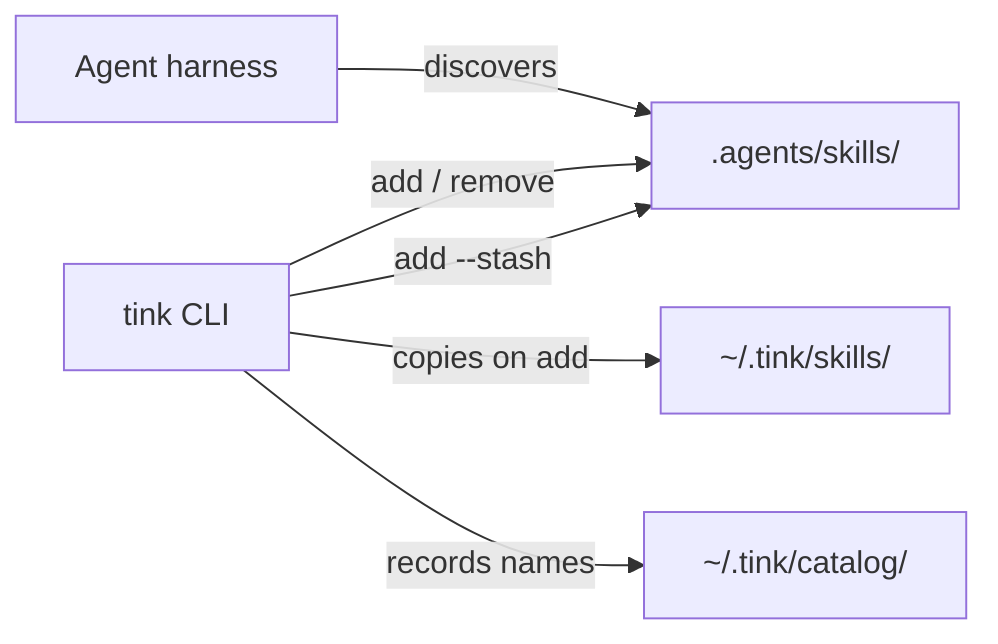

<p align="center">
  
</p>

# tink

Skill manager that makes sense to you, and your agent.

Live skills live only under a project’s `.agents/skills/<name>/`. There is no
registry and no daemon. Agents that already look for project skills find them
there.

## Install

```console
curl -fsSL https://raw.githubusercontent.com/jon-devlapaz/tink/main/install.sh | sh
```

That installs a release binary into `~/.local/bin/tink` (override with
`TINK_INSTALL_DIR`). Requires `curl` and `tar`. Supported hosts: macOS and
Linux on x86_64/arm64.

Update later with:

```console
tink update
```

### From source

You need a current Rust toolchain. For GitHub skill sources, `git` must be on
`PATH`.

```console
cargo install --git https://github.com/jon-devlapaz/tink.git --locked
```

From a checkout:

```console
cargo install --path . --root ~/.local --force
```

## First success

In an empty project directory:

```console
tink init
tink skill add jon-devlapaz/tink-skills --skill skill-scout
tink skill list
tink skill check
```

That installs live skill directories under `.agents/skills/`. Optional:  
`tink init --with-tink-skills` pulls the full
[tink-skills](https://github.com/jon-devlapaz/tink-skills) bundle (scout +
eval loop). On a TTY, `init` may ask about ZEN and that bundle; non-interactive
runs skip them unless you pass flags.

Defaults after `init`:

1. Creates `.agents/skills/`.
2. Ensures `~/.tink` exists.
3. Installs the embedded `manage-tink` skill.

**Agents:** follow [`skills/manage-tink/SKILL.md`](skills/manage-tink/SKILL.md).
The v1 command contract is [`ACCEPTANCE.md`](ACCEPTANCE.md).

## Model

A skill is a directory with `SKILL.md` and the files it needs. Project work uses
only `.agents/skills/`. A GitHub import writes `.tink-source.json`; `skill
refresh` checks that receipt. tink does not run skill code on add, check, or
refresh.



Home (`~/.tink` or `$TINK_HOME`) is **not** an agent discovery root. Stash holds
skill trees; catalog holds by-project **names** only.

## Use (everyday)

```console
tink skill add ../my-skill
tink skill add owner/repository --skill skill-name
tink skill add jon-devlapaz/tink-skills --skill skill-eval-loop
tink skill list
tink skill check
tink skill refresh
tink skill refresh skill-name
tink skill remove skill-name
```

- `--skill` when the source repo publishes several skills.
- Refresh only clean GitHub imports; local edits are refused.
- tink does not overwrite a project skill that differs from what it would
  install.
- tink never inits Git, stages, commits, or pushes.

## Power

Stash, catalog, init flags, and destroy:

```console
tink skill list --stash
tink skill add --stash skill-name
tink skill list --home

tink init --with-zen --with-tink-skills
tink init --no-zen --no-tink-skills --no-manage-tink

tink destroy --yes
tink update
```

If the GitHub tip is already in the stash and matches the tip byte-for-byte,
`skill add` may install from the stash. If the stash differs, tink repairs it
and warns. `skill remove` deletes only the project skill directory, not stash
or catalog.

### Uninstall the CLI

```console
rm -f ~/.local/bin/tink
# or, if installed via cargo:
cargo uninstall tink
```

## Layout

```text
.
├── ACCEPTANCE.md
├── ZEN.md
├── assets/
├── skills/           # embedded manage-tink (shipped with the binary)
├── src/
└── tests/
```

## Develop

```console
cargo test
cargo run -q -- init
```

See [ZEN.md](ZEN.md). Flag-level detail also lives in `tink --help` and
`ACCEPTANCE.md`.

## License

[MIT](LICENSE).
