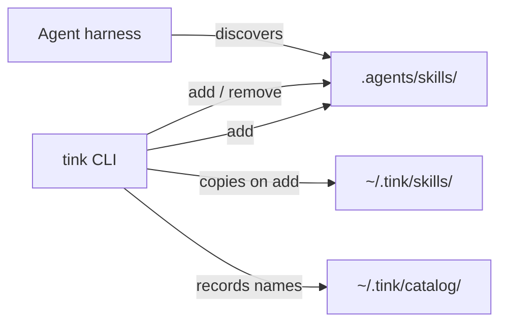

<p align="center">
  
</p>

# tink

Skill manager that makes sense to you, and your agent.

Tink 1.0 is feature-complete for the v1 acceptance boundary in
[`ACCEPTANCE.md`](ACCEPTANCE.md). Maintenance prioritizes correctness,
security, compatibility, and a simpler everyday experience over new lifecycle
machinery.

Live skills live only under a project’s `.agents/skills/<name>/`. Grouped
skillsets use one canonical nested root at
`.agents/skills/<name>-skillset/<member>/`. There
is no registry and no daemon. Agents that already look for project skills find
them there.

## Install

```console
curl -fsSL https://raw.githubusercontent.com/jon-devlapaz/tink/main/install.sh | sh
```

That installs a release binary into `~/.local/bin/tink` (override with
`TINK_INSTALL_DIR`). Requires `curl`, `tar`, and Python 3. The installer checks
GitHub's SHA-256 asset digest (accepting case-insensitive algorithm and hex
spelling), accepts exactly one regular `tink` archive entry,
probes the advertised version, and atomically replaces the destination.
Supported hosts: macOS and Linux on x86_64/arm64.

Update later with:

```console
tink update
```

### From source

The checkout pins Rust 1.95.0 with rustfmt and Clippy. For GitHub skill sources,
`git` must be on `PATH`.

```console
cargo install --git https://github.com/jon-devlapaz/tink.git --locked
```

From a checkout:

```console
cargo install --path . --root ~/.local --force
```

## Tab completion

Tink can complete commands, flags, and live library skill names. Add the line
for your shell to its startup file, then open a new shell:

```sh
# zsh (~/.zshrc)
autoload -Uz compinit
compinit
source <(COMPLETE=zsh tink)

# bash (~/.bashrc)
source <(COMPLETE=bash tink)
```

For Fish, save this as `~/.config/fish/completions/tink.fish`:

```fish
COMPLETE=fish tink | source
```

Then type `tink skill add ` and press Tab. The matches come from the current
Tink library, including skills added after completion was enabled.

## First success

In an empty project directory:

```console
tink init
tink skill list
tink skill check
```

On a TTY, `init` asks whether to install `skill-scout` and `triangulate-me`
from [tink-skills](https://github.com/jon-devlapaz/tink-skills). Accept that
prompt to install both live skill directories under `.agents/skills/`.
Non-interactive runs skip the optional bundle unless you pass
`--with-tink-skills`.

Defaults after `init`:

1. Creates `.agents/skills/`.
2. Ensures `~/.tink` exists.
3. Installs the embedded `manage-tink` skill.

**Agents:** follow [`skills/manage-tink/SKILL.md`](skills/manage-tink/SKILL.md).
The v1 command contract is [`ACCEPTANCE.md`](ACCEPTANCE.md).

## Model

A skill is a directory with `SKILL.md` and the files it needs. Project work uses
only `.agents/skills/`. A GitHub import writes `.tink-source.json`; `skill
refresh` checks that receipt. tink does not run skill code on add, check, or
refresh.



Tink lists and validates live project skills only under `.agents/skills/`. It
never promotes a home-library entry automatically or configures an agent
harness to discover the home. Library holds skill trees; catalog holds
by-project **names** only.

## Use (everyday)

```console
tink skill add ../my-skill
tink skill add skill-name
tink skill add owner/repository --skill skill-name
tink skill add owner/repository --skill packages/group/skills/skill-name
tink skill add jon-devlapaz/skill-eval-loop --skill skill-eval-loop
tink skillset add common-skillset
tink skillset list
tink skillset list --library
tink skillset refresh common-skillset
tink skillset remove common-skillset
tink inspect https://github.com/mattpocock/skills
tink library list
tink skill list
tink skill check
tink skill refresh
tink skill refresh skill-name
tink skill refresh manage-tink
tink skill remove skill-name
```

- A bare standalone `skill-name` promotes from the library (`tink library list`;
  `tink skill list --library` remains a compatibility alias).
  Receipt-backed roots remain skillsets and require `tink skillset ...` commands.
- `--skill` recursively selects a unique skill name from a remote repository.
  If that name occurs more than once, use the repository-relative path reported
  by the error or by `tink inspect`.
- GitHub tree URLs are inspection inputs, not `skill add` sources. Remote adds
  follow the repository's default branch and record the selected skill path.
- Refresh only clean GitHub imports; local edits are refused. The explicit
  `tink skill refresh manage-tink` path instead owns the reserved embedded
  package: it installs a missing copy, leaves a current copy unchanged, or
  atomically replaces differing receipt-free contents. Remote provenance is
  refused.
- tink does not overwrite a project skill that differs from what it would
  install.
- tink never inits Git, stages, commits, or pushes.

Executable intent is preserved when Tink copies complete skill trees. Regular
files are canonicalized to Git-portable `0644` or `0755` modes, while Unix path
identity remains byte-exact even for non-UTF-8 names. Symlinks and special files
are refused.

### Skillsets

Skillset names are explicit and canonical: every name must end in `-skillset`;
Tink never appends or removes that suffix. `skillset add NAME-skillset` reads
the pinned definition at
`$TINK_HOME/catalog/by-skillset/NAME-skillset/meta.json`. The definition contains an
absolute HTTPS Git URL, a full commit SHA, a repository-relative `sourceRoot`,
and explicit member names. Tink validates and consumes this externally authored
file but has no command that writes it. For example:

```json
{
  "source": "https://github.com/example/agent-skills.git",
  "revision": "0123456789abcdef0123456789abcdef01234567",
  "sourceRoot": "skills/review",
  "members": ["code-review", "security-review"]
}
```

Creating or changing that exact definition is a separate, explicitly authorized
authoring step. `tink inspect` can propose source structure, but it never creates a
definition. Do not hand-edit `.tink-skillset.json` receipts, installed skillset
trees, or derived `catalog/by-project` entries.

Tink copies those member skill trees atomically
under `.agents/skills/NAME-skillset/`, validates the project tree, then mirrors
that exact tree to `$TINK_HOME/skills/NAME-skillset/`. The project is primary;
the home library conforms to it and never overwrites it. Both copies carry
`.tink-skillset.json` as derived receipt evidence. Repeated identical installs
are offline no-ops. `skillset refresh NAME-skillset` updates a clean project to
its pinned catalog definition; local project modifications are refused. Library
drift is repaired only from a valid project tree.
`skillset remove NAME-skillset` removes only the project tree; it preserves the
shared catalog definition and home library copy.
`skillset list` groups each receipt-backed project skillset with its member
skills. `skillset list --library` shows the same grouped view for the home
library. Receipt ownership takes precedence over a root `SKILL.md`: standalone
library list/add commands never expose, promote, or replace that skillset root.

`tink inspect <GITHUB_URL>` performs a read-only inspection of a public GitHub
repository, folder, or skill URL. It reports directories containing valid
`SKILL.md` files and infers source skillsets from the URL boundary's directory
structure. Inspection never writes the project, catalog, or home library.

## Power

Library, catalog, init flags, and destroy:

```console
tink library list
tink skill add skill-name
tink skill harvest
tink skill list --catalog

tink init --with-zen --with-tink-skills
tink init --no-zen --no-tink-skills --no-manage-tink

tink destroy --yes
tink update
```

`tink skill list --catalog` always emits the `project`, `root`, `skill` TSV
header, including for an empty catalog. Within fields, backslash, tab, carriage
return, and newline are escaped as `\\\\`, `\\t`, `\\r`, and `\\n` so every
skill remains one three-column row.

**Breaking in 0.3.0:** `skill list --home` → `--catalog`; `skill list --stash` → `--library`. On-disk layout is still `$TINK_HOME/skills/` and `catalog/by-project/`. After updating the binary, refresh each project's embedded skill with `tink skill refresh manage-tink`.

Project lockfiles now use digest format/version 2 so file boundaries and Unix
executable modes are actually pinned. An older lock is deliberately refused;
run `tink skill lock` to regenerate it, then commit the result. Existing
skillset receipts migrate through `tink skillset refresh NAME-skillset`.

If the GitHub tip is already in the library and matches the tip byte-for-byte,
`skill add` may install from the library. If a standalone library skill differs,
tink repairs it and warns. A bare standalone skill name (not a path and not `owner/repo`) promotes from
the library into the project. `skill remove` deletes the project skill
directory and drops that name from the by-project catalog; it does not delete
library trees. `destroy` removes `.agents/skills/`, removes `.agents/` only when
it is then empty, and drops this project's catalog entry. It preserves
`AGENTS.md`, `ZEN.md`, unrelated `.agents/` siblings, and all library trees.

Successful output goes to stdout; warnings and failures go to stderr. A closed
stdout is normal pipeline termination (exit 0), while command and usage failures
remain exit 1 and exit 2 respectively.

### Uninstall the CLI

```console
rm -f ~/.local/bin/tink
# or, if installed via cargo:
cargo uninstall tink
```

## Layout

```text
.
├── ACCEPTANCE.md
├── ZEN.md
├── assets/
├── skills/           # embedded manage-tink (shipped with the binary)
├── src/
└── tests/
```

## Develop

```console
cargo test
./tink-test init
./tink-test skill list --catalog
```

`./tink-test` builds this checkout and runs `target/debug/tink` (not
`~/.local/bin/tink`). It forces `TINK_HOME` to `~/.tink-test` (override with
`TINK_TEST_HOME`) so dogfood does not touch `~/.tink`.

See [ZEN.md](ZEN.md). Flag-level detail also lives in `tink --help` and
`ACCEPTANCE.md`.

## License

[MIT](LICENSE).
