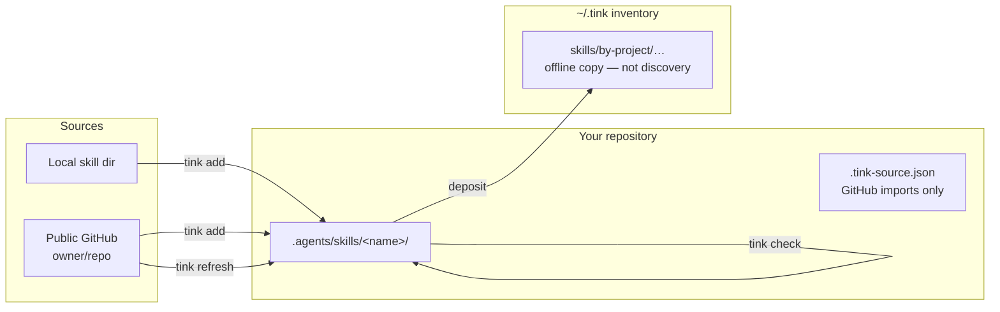

# Tink

**Your agents work best simply. Your config should too.**

Tink copies complete Agent Skills into a project's `.agents/skills/` directory.
No registry, no daemon, no required `~/.agents`. Agents that already look for
project skills (Codex and friends) find them where they live.

This is the Rust CLI. On disk it matches the older Python `tink-agents` layout,
so you can share a repo across both. The verbs are shorter: `init`, `refresh`,
`inventory` instead of `setup` / `pull` / `dump`.

## How it fits



Live skills are only under `.agents/skills/`. `~/.tink` is a backup inventory for
you (and for `tink inventory list`). Agents should not load skills from there.

## Install

Needs Rust (edition 2024 toolchain) and `git` on `PATH` for GitHub sources.

```console
cargo install --git https://github.com/jon-devlapaz/tink.git --locked
```

From a checkout:

```console
cargo install --path . --root ~/.local --force
```

Put that install root's `bin` ahead of any older Python `tink` on your `PATH`.

## Use

```console
# Create .agents/skills/ and ensure ~/.tink exists
tink init

# Copy one local skill, or one skill from a public GitHub repo
tink add ../my-skill
tink add owner/repository --skill skill-name

# Validate without network or writes
tink check

# Refresh clean GitHub imports; local edits are refused
tink refresh
tink refresh skill-name

# List this project's offline inventory copies
tink inventory list
```

Override the inventory root with `TINK_HOME`. If you also use Python
`tink-agents`, set `TINK_DUMP_DIR` to the same path so both tools share one tree.

Tink does not init Git, stage files, commit, push, or overwrite a skill that
diverged from what it would install.

## Model

Each skill is a directory with `SKILL.md` plus whatever it needs. A GitHub
import also gets a tracked receipt:

```json
{
  "source": "https://github.com/owner/repository.git",
  "revision": "full-git-object-id",
  "path": "skills/example"
}
```

Those three fields are enough to prove whether the install still matches the
recorded source before a refresh. Tink does not execute skill code during
`add`, `check`, or `refresh`.

## Develop

```console
cargo test
cargo run -q -- init
```

What “done” means for this tree is spelled out in [ACCEPTANCE.md](ACCEPTANCE.md).
Maintainability notes live in [ZEN.md](ZEN.md).

## License

[MIT](LICENSE).
