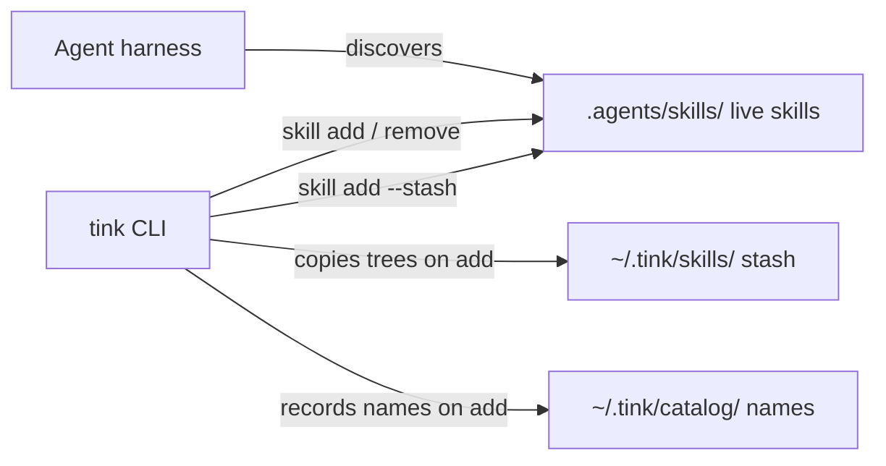

<p align="center">
  
</p>

# tink

Install Agent Skills into a project's `.agents/skills/`.

tink copies a complete skill directory into the project. There is no registry
and no daemon. You do not need `~/.agents`. Agents that already look for
project skills find them in `.agents/skills/`.

If you are an agent, follow [`skills/manage-tink/SKILL.md`](skills/manage-tink/SKILL.md).
The v1 command contract is [`ACCEPTANCE.md`](ACCEPTANCE.md).

## Install

You need a current Rust toolchain. For GitHub sources, `git` must be on `PATH`.

```console
cargo install --git https://github.com/jon-devlapaz/tink.git --locked
```

From a checkout:

```console
cargo install --path . --root ~/.local --force
```

### Uninstall

```console
cargo uninstall tink
```

If you installed with `--root ~/.local`:

```console
cargo uninstall --root ~/.local tink
```

## Use

```console
tink init
tink skill add ../my-skill
tink skill list
tink skill list --home
tink skill list --stash
tink skill add --stash my-skill
tink skill remove my-skill
tink skill check
```

`init` does this by default:

1. Creates `.agents/skills/`.
2. Ensures `~/.tink` exists.
3. Installs the embedded `manage-tink` skill.

On a TTY it may ask about ZEN and the tink-skills bundle (`skill-scout`,
`skill-eval-loop`). Non-interactive runs skip those unless you pass flags.

### More

```console
# Init options (non-interactive)
tink init --with-zen --with-tink-skills
tink init --no-zen --no-tink-skills --no-manage-tink

# GitHub source; --skill when the repo has several skills
tink skill add owner/repository --skill skill-name

# Promote a skill from the home stash into this project
tink skill add --stash skill-name

# Refresh clean GitHub imports; local edits are refused
tink skill refresh
tink skill refresh skill-name

# Remove one project skill (not home stash or catalog)
tink skill remove skill-name

# Remove project agent scaffolding (not ~/.tink)
tink destroy --yes
```

Set `TINK_HOME` to use a different home directory.

A successful install copies the skill tree to `~/.tink/skills/<name>/`.
It records the skill name in `~/.tink/catalog/by-project/<project>/meta.json`.
Home is not an agent discovery root.

`tink skill list --stash` lists stashed skill names.
`tink skill add --stash <name>` copies one into the project.
`tink skill list --home` prints the name catalog as TSV (`project`, `root`,
`skill`).

If the GitHub tip is already in the stash, and the stash copy matches the tip
byte for byte, `skill add` installs the project skill from the stash.
If the stash copy differs, tink repairs the stash and writes a warning.
tink does not overwrite a different project skill.

tink does not:

- init Git
- stage files
- commit
- push

tink does not overwrite a skill that differs from the skill it would install.
`skill remove` deletes only the project skill directory; it does not prune the
home stash or catalog.

## Model

A skill is a directory that contains `SKILL.md` and the files that skill uses.
A GitHub import writes a `.tink-source.json` receipt.
`skill refresh` uses the receipt to check that the installed skill still
matches its source.
tink does not run skill code during add, check, or refresh.

### Where skills live

Purpose: show the live project boundary versus home stash and catalog.
Scope: install/promote paths only; not refresh internals or Git.



Installed project skills exist only under `.agents/skills/`.
`~/.tink` stores skill trees in `skills/<name>/`.
`~/.tink` stores the by-project name catalog in `catalog/by-project/`.
Agents do not load skills from home.
To install a stashed skill into the project, run
`tink skill add --stash <name>`.


## Layout

```text
.
├── ACCEPTANCE.md     # v1 command and on-disk contracts
├── ZEN.md            # maintainability principles
├── assets/           # logo
├── skills/           # embedded manage-tink (shipped with the binary)
├── src/              # Rust CLI
└── tests/            # acceptance tests
```

After `init` or `skill add`, installed skills are under `.agents/skills/<name>/`.

## Develop

```console
cargo test
cargo run -q -- init
```

Maintainability notes are in [ZEN.md](ZEN.md).

## License

[MIT](LICENSE).
