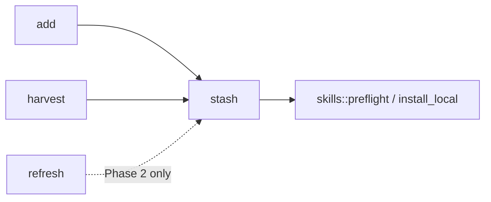

# Handoff: Unify stash write policy

**Repo:** tink (`main` @ shipped `v0.2.2` baseline; branch from current `main`)  
**Outcome:** One module owns “what happens when `$TINK_HOME/skills/<name>/` exists and differs.” Callers express intent; they do not re-implement preflight branches.  
**Authority:** This plan + existing [`ACCEPTANCE.md`](../ACCEPTANCE.md) rows A6, H6–H8, P5–P7. Do not expand product behavior.  
**Non-goals:** discovery unification, three-store install deepen, paths module, new CLI flags, stash prune, version bump/release unless product asks.

**Framing:** Prefer the smallest complete loop. Do **not** introduce a `StashPolicy` enum/trait/adapters in Phase 1 unless the compile forces a shared type. Charge complexity rent — deletion of `harvest::create_only_deposit` is the win.

---

## Context (why)

Today diverge handling is split:

| Caller | Function | On diverge |
|--------|----------|------------|
| `add` | `stash::deposit` | repair |
| `harvest` | `harvest::create_only_deposit` | skip (receipt-equal body → unchanged) |
| `refresh` | `preflight_refresh` / `deposit_refresh` / `sync_from_installed` | refuse or sync under refresh rules |

All three already sit on `skills::preflight_install` outcomes. The bug class is locality, not missing features.

---

## Baseline (before any edit)

**Gate B0**

- [ ] Working tree clean; branch cut from current `main`
- [ ] `cargo test --test acceptance` → 55 pass
- [ ] Record HEAD SHA for rollback

---

## Phase 1 — Move create-only into `stash` (required)

**Intent:** Harvest stops owning diverge logic. Behavior unchanged.

### Steps

1. In [`src/stash.rs`](../src/stash.rs), add a create-only write path next to `deposit` (same preflight, same tree engine):
   - `Ready` → `skills::install_local(..., None)` → Created
   - `Identical` → Unchanged
   - `Divergent` + body equal except `.tink-source.json` → Unchanged
   - `Divergent` otherwise → Skipped (no repair, no write)
   - Unsafe/unreadable trees → Skipped with reason (match today’s harvest error→skip)
2. Return a small result harvest’s CLI already understands (Created / Unchanged / Skipped + optional detail). Avoid a parallel type zoo; reuse or map cleanly to `HarvestAction`.
3. In [`src/harvest.rs`](../src/harvest.rs), delete `create_only_deposit`; call the stash function. Keep root tables, recursive walk, name collision, and “skip under home stash root” in harvest.
4. Leave [`src/add.rs`](../src/add.rs) on `stash::deposit` (repair). Leave refresh helpers unchanged.

### Gate P1 (all must pass)

| Check | Expect |
|-------|--------|
| `cargo test --test acceptance a6_` | Repair-on-add unchanged |
| `cargo test --test acceptance h6_ h7_ h8_` | Identical / skip diverge / unsafe + stash-root skip |
| `cargo test --test acceptance skill_harvest` | All harvest rows |
| `cargo test --test acceptance` | Full suite green |
| Diff review | `create_only_deposit` gone from harvest; no new public policy enum unless unavoidable |
| Docs | No ACCEPTANCE.md product-behavior edits required for Phase 1 |

**Stop if:** A6 or H7 behavior flips, or the change grows a framework instead of a moved function.

**Phase 1 alone is a complete, shippable PR.**

---

## Phase 2 — Refresh locality (optional, only if cheap)

**Intent:** If refresh’s stash path is a thin wrapper over the same preflight, route it through `stash` without changing P* outcomes.

### Steps

1. Read [`src/refresh.rs`](../src/refresh.rs) and [`src/stash.rs`](../src/stash.rs) (`preflight_refresh`, `deposit_refresh`, `sync_from_installed`).
2. Fold only clear duplication. Do **not** merge refuse-with-error into create-only skip.
3. If folding needs new policy vocabulary or changes P5/P7 semantics → **skip Phase 2**; note follow-up instead of forcing it.

### Gate P2

| Check | Expect |
|-------|--------|
| `cargo test --test acceptance p1_ p2_ p3_ p4_ p5_ p6_ p7_` | All refresh rows unchanged |
| `cargo test --test acceptance` | Full suite green |
| Diff | Net deletion or neutral; no new acceptance rows |

**Stop if:** Refresh refuse cannot share a type with harvest skip without semantic muddle.

---

## Phase 3 — Unit tests at the stash seam (optional leverage)

**Intent:** Prove diverge outcomes without the full CLI (acceptance stays the product evaluator).

### Steps

1. Add focused unit tests in `stash` (temp `TINK_HOME`) for:
   - missing → create (create-only)
   - identical → unchanged
   - diverge → skip (create-only)
   - diverge → repair (`deposit`)
   - receipt-only body match → unchanged (create-only)
2. Do **not** delete acceptance rows.

### Gate P3

| Check | Expect |
|-------|--------|
| `cargo test` filtered to new stash unit tests | Pass |
| `cargo test --test acceptance a6_ h6_ h7_` | Still green |
| Assertions | Outcomes / tree bytes — not private helper names |

---

## Explicit out of scope

| Item | Why |
|------|-----|
| `StashPolicy` enum / trait / strategy pattern in Phase 1 | Speculative abstraction |
| Unifying `skills::discover` vs harvest walk | Separate architecture candidate |
| Deepening `place_skill` three-store contract | Separate candidate |
| `paths::project_skills_root` | Separate candidate |
| Automating ACCEPTANCE S2 | Separate candidate |
| Changing create-only ↔ repair product semantics | Needs explicit product ask |

---

## Suggested PR shape

- **Branch:** `refactor/stash-create-only-owner` (from `main`)
- **Commits:** one commit per phase that lands; Phase 1 alone is enough to merge
- **PR body:** link this document; paste Gate P1 command results; state behavior-preserving
- **Release:** do not bump Cargo version / tag unless asked

---

## Done when

Phase 1 Gate P1 is green and `harvest` no longer contains diverge-branch write logic. Phases 2–3 are optional follow-ups, not blockers for this handoff.
