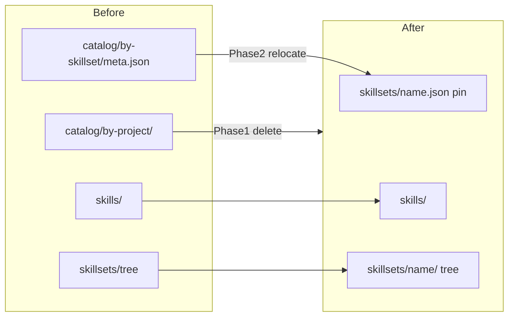

# Implementation Plan: Catalog Folders Removal

## Overview

Remove unnecessary home-catalog overhead in two sequential phases. Phase 1 deletes `$TINK_HOME/catalog/by-project/` (derived index only). Phase 2 relocates skillset **desired pins** from `$TINK_HOME/catalog/by-skillset/<name>/meta.json` to a sibling file `$TINK_HOME/skillsets/<name>.json`, then drops `by-skillset/`. No receipt-only pin collapse; desired ≠ installed stays.

## Architecture Decisions

- **by-project is deleted, not replaced.** Sole unique UX was `tink skill list --catalog`. Live authority remains `.agents/skills/` (+ optional `.tink/skills.toml` / lock). Leftover `catalog/by-project/` dirs are ignored (no migrator); sole-user wipe is fine.
- **by-skillset pin moves, meaning unchanged.** Same `SkillsetMeta` schema (`source`, `revision`, `sourceRoot`, `members`). New path: `$TINK_HOME/skillsets/<name>.json` beside the tree dir `$TINK_HOME/skillsets/<name>/` (outside digest/copy boundary).
- **Write order for update stays:** replace project tree → write pin file → sync library mirror.
- **Top-level `catalog/`:** removed from home layout once both children are gone; `validate_direct_owners` drops `catalog`.
- **Reserved skill name `by-project`:** keep through Phase 1 (A7); drop in a tiny follow-up only if desired after leftovers are irrelevant.
- **No migration readers** for old catalog paths (matches prior “no migration” preference). Document: delete old catalog trees or re-`skillset add`.

## Incremental delivery rule

Each task below is one commit-sized slice: implement → focused acceptance/unit tests → leave tree green → then next task. Do not combine Phase 1 and Phase 2 in one PR unless Phase 1 is already merged.

---

## Phase 1: Delete by-project

### Task 1: Stop depositing / withdrawing / forgetting

**Description:** Remove all by-project catalog writes and preflights from publish/remove/destroy/sync/refresh/manage-tink/rollback paths so lifecycle no longer depends on the index.

**Acceptance criteria:**
- [ ] No calls to `catalog::deposit_*`, `withdraw_*`, `forget_*`, or `preflight_*` remain outside `catalog.rs` (or those APIs are deleted with the module)
- [ ] `skill add` / `remove` / `destroy` / `skill sync` succeed with a deliberately broken or absent `catalog/by-project/` tree

**Verification:**
- [ ] `cargo test --test acceptance` filters covering add/remove/destroy/sync still pass (minus catalog assertions)
- [ ] Manual: broken `catalog/by-project/meta` no longer blocks `skill remove`

**Dependencies:** None

**Files likely touched:**
- [`src/inventory.rs`](src/inventory.rs), [`src/remove.rs`](src/remove.rs), [`src/destroy.rs`](src/destroy.rs), [`src/manifest.rs`](src/manifest.rs), [`src/refresh.rs`](src/refresh.rs), [`src/manage_tink.rs`](src/manage_tink.rs), [`src/rollback.rs`](src/rollback.rs)

**Estimated scope:** Medium

### Task 2: Remove `--catalog` CLI and `catalog.rs` module

**Description:** Drop `skill list --catalog`, delete [`src/catalog.rs`](src/catalog.rs), and unwire it from [`src/lib.rs`](src/lib.rs).

**Acceptance criteria:**
- [ ] `tink skill list --catalog` is rejected as unknown/removed flag
- [ ] `src/catalog.rs` gone; crate builds
- [ ] No `list_catalog` tests remain

**Verification:**
- [ ] `cargo test -p tink --lib`
- [ ] Clap help for `skill list` has no `--catalog`

**Dependencies:** Task 1

**Files likely touched:**
- [`src/catalog.rs`](src/catalog.rs) (delete), [`src/lib.rs`](src/lib.rs), callers’ unit tests

**Estimated scope:** Medium

### Task 3: Home layout + reserved-name cleanup for by-project

**Description:** Stop creating `catalog/by-project/`; remove or gut `migrate_catalog_if_needed` / legacy `skills/by-project` migrate; update home README. Keep top-level `catalog/` only if Phase 2 not yet done (still needed for by-skillset until Phase 2 Task 6).

**Acceptance criteria:**
- [ ] Fresh `ensure_inventory_root` does not create `catalog/by-project/`
- [ ] I4-style init still creates whatever catalog parents Phase 2 still needs
- [ ] Home README no longer documents by-project index

**Verification:**
- [ ] `cargo test -p tink --lib home::`
- [ ] acceptance `i4_init_ensures_inventory_root`

**Dependencies:** Task 2

**Files likely touched:**
- [`src/home.rs`](src/home.rs)

**Estimated scope:** Small

### Task 4: Acceptance + manage-tink for by-project removal

**Description:** Delete/rewrite acceptance rows L3/L6/L10–L13, A9, X6/X7, catalog clauses in X1/D1/I6/A1/H2; update manage-tink ownership tables; drop `assert_cataloged` / `catalog_meta` helpers or shrink them.

**Acceptance criteria:**
- [ ] No acceptance sensor requires `catalog/by-project/`
- [ ] manage-tink no longer instructs `skill list --catalog` or by-project deposit proofs
- [ ] Full acceptance suite green

**Verification:**
- [ ] `cargo test --test acceptance`
- [ ] Grep clean for `by-project` in user-facing skill docs (except reserved-name A7 if kept)

**Dependencies:** Task 3

**Files likely touched:**
- [`ACCEPTANCE.md`](ACCEPTANCE.md), [`ACCEPTANCE.compact.md`](ACCEPTANCE.compact.md), [`tests/acceptance.rs`](tests/acceptance.rs), [`skills/manage-tink/`](skills/manage-tink/), [`README.md`](README.md), [`docs/ARCHITECTURE.md`](docs/ARCHITECTURE.md)

**Estimated scope:** Medium

### Checkpoint: Phase 1
- [ ] All Phase 1 tests green
- [ ] Dogfood: add/remove/destroy with no by-project dir
- [ ] Human review before Phase 2

---

## Phase 2: Relocate by-skillset pins

### Task 5: Pin path helper + read/write seam (dual-read optional: no)

**Description:** Introduce `skillset_pin_path(home, name) -> skillsets/<name>.json` and switch `read_catalog` / `ensure_catalog_definition` / update writer to that path only (no fallback to old catalog).

**Acceptance criteria:**
- [ ] URL add create-only writes `$TINK_HOME/skillsets/<name>.json`
- [ ] Name add / refresh / update read that file
- [ ] Pin file is never inside the mirrored tree digest

**Verification:**
- [ ] Unit tests for path + create-only collision
- [ ] Focused K12-style URL add still creates pin + tree

**Dependencies:** Phase 1 checkpoint

**Files likely touched:**
- [`src/skillsets.rs`](src/skillsets.rs), [`src/home.rs`](src/home.rs)

**Estimated scope:** Medium

### Task 6: Stop creating `catalog/by-skillset/`; drop empty `catalog/`

**Description:** Remove `by_skillset_path` mkdir and, if unused, remove top-level `catalog/` from layout + `validate_direct_owners`.

**Acceptance criteria:**
- [ ] Fresh home has `skills/` + `skillsets/` only (plus layout/README)—no `catalog/`
- [ ] Existing `catalog/` leftovers ignored

**Verification:**
- [ ] `home::` tests + `i4_init_ensures_inventory_root`

**Dependencies:** Task 5

**Files likely touched:**
- [`src/home.rs`](src/home.rs)

**Estimated scope:** Small

### Task 7: Retarget skillset acceptance (K1/K2/K10/K12/K13)

**Description:** Point `Workspace::skillset_meta` / `write_skillset_meta` at `skillsets/<name>.json`; rewrite K2 “preserves definition” to the new path; keep K10 edit-pin-then-refresh.

**Acceptance criteria:**
- [ ] K1, K1B, K1C, K2, K10, K12, K13 green against new pin locus
- [ ] After `skillset remove`, pin file + library tree remain; re-add by name works

**Verification:**
- [ ] `cargo test --test acceptance skillset`

**Dependencies:** Task 6

**Files likely touched:**
- [`tests/acceptance.rs`](tests/acceptance.rs), [`ACCEPTANCE.md`](ACCEPTANCE.md), [`ACCEPTANCE.compact.md`](ACCEPTANCE.compact.md)

**Estimated scope:** Medium

### Task 8: Docs + manage-tink pin authoring path

**Description:** Replace all `catalog/by-skillset/.../meta.json` authoring instructions with `skillsets/<name>.json`; fix “no definition writer” drift (URL add + update write pins); Architecture state table updated.

**Acceptance criteria:**
- [ ] manage-tink Step 2/3 and commands.md schema path updated
- [ ] ARCHITECTURE / README describe pin beside skillsets library
- [ ] X5 content sensors updated

**Verification:**
- [ ] Grep: no `catalog/by-skillset` in skills/docs/acceptance
- [ ] `cargo test --test acceptance` X5 / manage-tink rows

**Dependencies:** Task 7

**Files likely touched:**
- [`skills/manage-tink/`](skills/manage-tink/), [`docs/ARCHITECTURE.md`](docs/ARCHITECTURE.md), [`README.md`](README.md)

**Estimated scope:** Small–Medium

### Checkpoint: Phase 2 / Complete
- [ ] Full `cargo test --test acceptance` + `cargo test -p tink --lib`
- [ ] Dogfood matrix: URL add, remove, re-add by name, update, K10-style pin edit + refresh; confirm no `catalog/` on fresh home
- [ ] Ready for review

---

## Risks and Mitigations

| Risk | Impact | Mitigation |
|------|--------|------------|
| Mid-update pin write fails after tree replace | Med | Keep project-first write order; idempotent retry; acceptance already assumes this |
| Pin file accidentally copied into tree sync | High | Sibling `.json` beside dir; never under `skillsets/<name>/` |
| Docs still say `--catalog` / old meta path | Med | Task 4 + Task 8 grep gates |
| Scope bleed into receipt-only redesign | High | Explicitly out of scope; stop if tempted |

## Out of scope

- Collapsing desired pin into `.tink-skillset.json` only
- Project-local `.tink/` skillset manifest
- Rebuilding a cross-project skill index
- Migrating old catalog files automatically

## Open Questions

None blocking — decisions locked from research spike + sole-user no-migration preference.

## Definition of Done (every task)

Per [definition-of-done](.agents/skills/planning-and-task-breakdown/references/definition-of-done.md): acceptance criteria met, tests fail-then-pass for new behavior, no unrelated refactors, docs match current paths, human review before merge of each phase.
